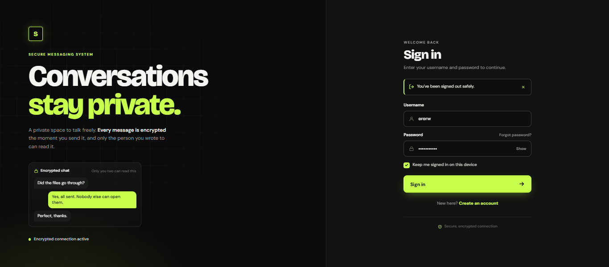

# Secure Messaging System

A simple Django based messaging system where users can create accounts, send messages, and receive messages securely

## Features
* User signup and login
* Admin approval for new accounts
* Send and receive messages
* Messages are encrypted using AES-GCM
* User profile and password change
* Admin can verify or remove users
* Admin can check and decrypt conversations

# Technologies

* Python
* Django
* SQlite
* HTMl & CSS & litle bit JavaScript
* Cryptography (AES-GCM)

## Folder structure

SecureMessagingSystem/ 
├── accounts/ 
│ ├── models.py 
│ ├── views.py 
│ ├── urls.py 
│ ├── crypto.py 
│ ├── management/ 
│ │ └── commands/ 
│ │ └── create_default_admin.py 
│ └── templates/ 
│ └── accounts/ 
├── config/ 
│ └── settings.py 
├── manage.py 
├── setup.bat 
└── db.sqlite3

## How to run
Deployed Version:
https://suhaibkhan.pythonanywhere.com/

Run Locally
create a virtual environment:
python -m venv venv
venv\Scripts\activate

Install the required pakages:
pip install django
pip install cryptography

Then set up the database:
Run migrations:
python manage.py makemigrations
python manage.py migrate

Create the defalut admin:
python manage.py create_default_admin

Strat the server:
python manage.py runserver

Then open:
http://127.0.0.1:8000/

## Admin login
I hardcoded a default admin in `create_default_admin.py`:

- Username: `Humhai`
- Password: `hojabhai333`

## AI Usage
Claude AI was used only for UI inspiration for the login and signup. I used a screenshot of the Cloude generated design to take inspiration from its layout and color choice,

The screenshot below shows the Claude ai design that was used only as a reference for the login and signup page layout and colors.

## Project Screenshot

## What Next
* Complete the remaining UI
* Improve the overall look and user experience